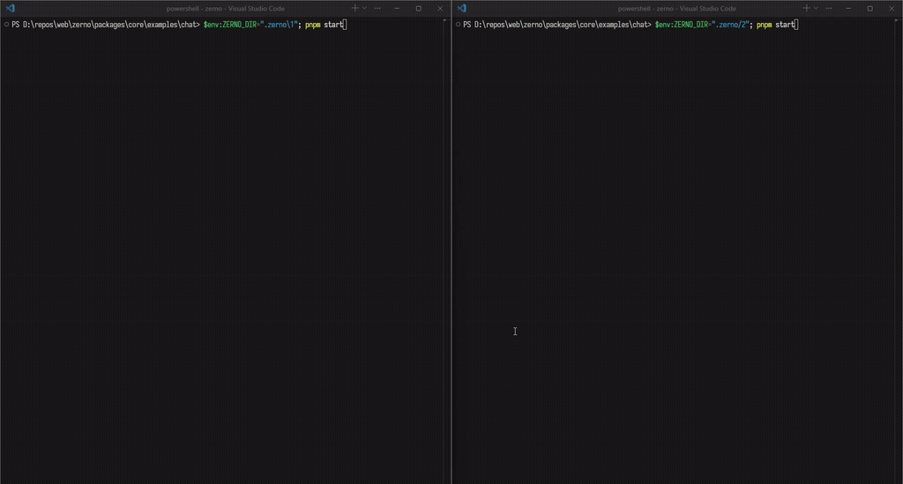

# `zerno-chat`

Ink/React TUI for local-first group chat with access control.

## Architecture

Chat data is spread across three document types, discoverable from a workspace document:

* [`ZernoWorkspace`](./src/service/workspaces.ts) holds the list of group URLs.
* [`ZernoGroup`](./src/service/groups.ts) holds the group name, a reference to its phonebook, and a per-author message list URL for every member.
* [`ZernoPhonebook`](./src/service/phonebook.ts) maps member identifiers to their contact cards, so peers can resolve contact cards for grant flows.

Messages are written to a per-author message list. When sending, the author grants read access to their own message list to every group member, so others can decrypt the messages. The `ZernoGroup` document only provides the references to these message lists; access to each message list is granted separately by its author.

## Quick start

Start two independent peers with separate local storage directories. We use different `ZERNO_DIR` values so each process has its own local state.

### Peer 1

```sh
ZERNO_DIR=".zerno/1" pnpm start
```

### Peer 2

```sh
ZERNO_DIR=".zerno/2" pnpm start
```

## UI

### Keyboard shortcuts

| Shortcut      | Description                                                          |
| ------------- | -------------------------------------------------------------------- |
| `tab`         | Move focus to the next panel.                                        |
| `shift+tab`   | Move focus to the previous panel.                                    |
| `up` & `down` | Select the previous/next group (when the `Groups` panel is focused). |

### Groups

The list of groups in your workspace. Use the arrow keys (`up` & `down`) to select a group.

### Messages

Messages of the selected group

### Group

Info about the selected group: name, member count, group URL, and members with their access levels.

### Command input

Where you type messages and commands. See [commands](#commands)

## Workflow



Create a group on Peer 1:

```text
Peer 1> /new My Group
```

To grant another user access to your group, you first need their identity. Copy Peer 2's contact card to the clipboard:

```text
Peer 2> /copy contact-card
```

Grant access from Peer 1, pasting the contact card copied by Peer 2:

```text
Peer 1> /grant edit eyJSb3RhdGUiOnsicGF5bG9hZCI6...
```

The Group panel on Peer 1 should now show Peer 2 as a group member.

Copy the group URL from Peer 1:

```text
Peer 1> /copy group-url
```

On Peer 2, open the group using that URL:

```text
Peer 2> /open ei8G5sEVjM...
```

Peer 2 receives the `ZernoGroup` document and its access grants through the relay. The `ZernoGroup` document provides the `ZernoPhonebook` reference and the per-author message list URLs needed to discover the group's members and messages.

Switch focus to the command input with tab and send a message on either peer:

```text
hello, peer-2!
```

The message is written to the sender's per-author message list, and the sender grants read access to that list to the other group members. Once the message list syncs through the Subduction relay, the other peers can decrypt and display the message.

## Commands

### `<message>`

Any input that does not start with `/` is sent as a chat message to the selected group.

```text
Hello, world!
```

### `/new <name>`

Create a group with the given name and add it to your workspace. You become the group `admin` (see [access levels](#access-levels)).

```text
/new My Group
```

### `/open <group-url>`

Open a group by its URL and add it to your workspace.

The group URL is copied by a group member with [`/copy group-url`](#copy-contact-cardgroup-url). Opening waits for the group's access grants to arrive from the relay, which can take a moment.

```text
/open ei8G5sEVjM...
```

### `/close`

Remove the selected group's URL from your workspace. The group document is not deleted; open it again with [`/open <group-url>`](#open-group-url).

```text
/close
```

### `/copy <contact-card/group-url>`

Copy a value to the clipboard.

#### `/copy contact-card`

Your own contact card, encoded as Base64. This value is intended to be shared with another peer and later passed to [`/grant`](#grant-relayreadeditadmin-contact-card)

```text
/copy contact-card
```

#### `/copy group-url`

Group URL of the selected group, must be passed to [`/open`](#open-group-url) on the another peer.

```text
/copy group-url
```

### `/grant <relay|read|edit|admin> <contact-card>`

Grant another identity access to the selected group.

The contact card must be the Base64 value produced by `/copy contact-card`.

```text
/grant read eyJSb3RhdGUiOnsicGF5bG9hZCI6...
```

#### Access levels

| Level   | Description                                                                        |
| ------- | ---------------------------------------------------------------------------------- |
| `relay` | Can relay encrypted synchronization traffic but cannot read the document contents. |
| `read`  | Read-only access.                                                                  |
| `edit`  | Read and modify the document.                                                      |
| `admin` | Full administrative access, including granting permissions to others.              |
